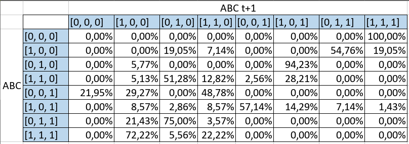

# Proyecto Análisis y Diseño de Algoritmos 

1. Luis Andréns Martínez Estremor
2. Luis Emilio Grijalba Ramirez

## iniciar proyecto
```bash
 pip install -r requirements.txt
```

## Taller 1
```
python3 taller1.py
```

## Taller 2
```
python3 taller2.py
```

## Taller 3
Partiremos de la siguinte tabla de distribución de porbabilidades


[Trests](./data_taller3/Tests.xlsx)
1. (A t+1 | ABC = 101)
2. (C t+1 | A = 0)
3. (AB t+1 | AB = 10)


```
python3 -m unittest taller3.py
```
